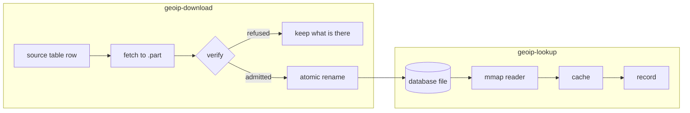
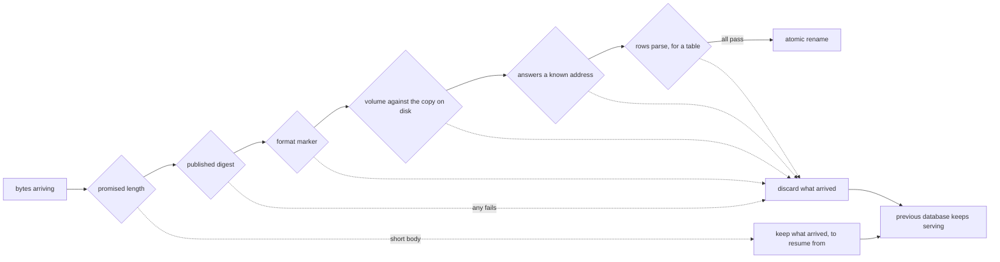

<!-- Project:   factbook -->
<!-- File:      docs/architecture.md -->
<!-- Purpose:   How acquisition, verification and lookup fit together -->
<!-- License:   Apache-2.0 -->
<!-- Copyright: (c) 2026 HYPERI PTY LIMITED -->

# Architecture

factbook is two halves that meet at a file on disk. Acquisition fetches and verifies; lookup maps and caches. They are separate features, so a consumer can take either alone.

## The Two Halves Meet at the DB File

Nothing passes a record between the halves. Acquisition finishes when the file is in place, and lookup starts by mapping whatever is there -- which is why a deployment that pre-seeds its databases, or mounts them read-only, can take the lookup half and no HTTP stack at all.

## The atomic rename is what makes the memory map safe

A reader over the resident ceiling holds a memory map of the file. Writing a refresh into that file in place changes bytes underneath a live mapping, which is undefined behaviour. Downloading to a `.part` file and renaming means the mapped inode is never written to, so the old reader keeps answering from it until something reopens it.

A resident reader has no mapping to invalidate, so it is not exposed to that. The rename still matters for it: a reader opened part way through an in-place write would read half of one build and half of another.

`refresh_if_changed` is that something. It stats each file, reopens whichever moved, and swaps the reader set in one atomic store. Nothing starts a timer -- a library that spawns its own thread imposes that thread on every consumer, so the schedule belongs to the caller.

Nothing dangles if a process dies mid-update:

- The transfer holds an advisory lock on a `.lock` file beside the destination, so two processes sharing a data directory cannot interleave into it. That file exists for the lock alone: the part file is unlinked and recreated mid-transfer, and a lock follows the inode rather than the name. The kernel releases the lock when the process holding it goes away.
- A second process finding the lock held is turned away before it makes a request, so it spends none of the provider's quota and reads what is on disk.
- A panic while the readers are being swapped poisons a lock guarding a path and a timestamp. It is recovered rather than failing every refresh from then on.

## A refusal keeps the previous database

The transfer checks what arrives, and the guard checks the staged file before the rename. Nothing is ever checked at the destination, because a bad file there would carry a fresh modification time the freshness check would then refuse to replace.

Six checks, in the order they run:

A short body is the one refusal that keeps its bytes: they are a valid prefix of the file, so the next run continues from them with a `Range` request rather than re-fetching tens of megabytes.

The digest runs only where a publisher publishes one, and it is the expensive check: a full read and hash of the archive. The last three belong to the guard, which runs the volume floor first because two `stat` calls cost less than mapping a database. The last two of those never both apply -- a provider database is probed for an address and a table has its rows parsed, and the guard is built carrying only the one its payload takes.

## The cache is keyed on the address, not its text

Reference lookups are heavily frequency-biased, so most traffic is repeats. The cache removes a database traversal for each one.

Three consequences shape the record type:

- The key is `IpAddr`, so `::1` and its long form are one entry, and no string is hashed or allocated per lookup.
- A hit hands back an `Arc`, because copying a record to reproduce something already in memory costs more than the hit itself.
- Private and reserved ranges never reach the cache. They cannot have an answer, so they short-circuit to one shared record.

Cached answers are cleared when the reader set is swapped rather than aged out on a timer. An answer only goes stale when the file behind it changes, so clearing on the swap is exact and leaves no window.

## One record shape, several source schemas

Providers disagree about how a record is written. MaxMind nests, and DB-IP and sapics follow it. IPinfo is flat and writes an autonomous system number as text with an `AS` prefix.

Each database names its own schema in its metadata, so the reader dispatches on the file rather than on config. A pre-seeded or mounted file is handled the same as a downloaded one. Every schema lands on the same flat record, which is what lets answers from different sources merge.

The typed fields are the ones every provider publishes. A source carries more than that, and none of it is discarded: after the typed decode the record is read a second time with no schema, flattened to dotted paths -- `city.names.de`, `subdivisions.0.iso_code`, `isp` -- and everything the typed decode did not take lands in `record.extra`. So a paid edition, a richer free build or a provider nobody has written a field for delivers its fields with no change here. The test is on the value rather than the path alone, which is what keeps a superseded subdivision, or a field whose wire type the typed shape refused, in the map instead of lost. The cost is a second record decode on the miss path, which the cache pays once per address; the located cold read measures 1.7 microseconds against 2.7, and 2.1 against 5.4 on a record the size a city build writes.

## Features draw the dependency line

| feature | pulls in | for |
|---|---|---|
| `geoip-download` | HTTP, TLS, gzip, tar | fetching and verifying |
| `geoip-lookup` | resident or mapped reader, cache | answering |
| `metrics` *(default)* | the `metrics` facade | download outcomes and database age |
| `metrics-lookup` | the same facade | cache hits, misses, size and lookup duration |

A download-only build carries no database reader, and a lookup-only build carries no HTTP client, because neither feature lists the other's dependencies. CI checks that with a feature-matrix build rather than trusting it, which is what catches a module behind one feature quietly using a crate another feature declares. Test builds are the exception: the dev-dependencies pull an HTTP client whatever features are selected.

The two metrics features split on cost. Acquisition metrics run once per database per refresh, so they are on by default and the database-age gauge is the only signal a deployment has that its downloads stopped working. Lookup metrics cost three to four times a cache hit, on the one path the crate exists to make fast, so they are opt-in. Details: [metrics.md](metrics.md).

There is deliberately no VRL feature yet. A host embedding VRL will want a record mapped into its value type, but declaring the feature before the code exists pulls two grammar builds into every consumer's build and returns no API. Adding it later breaks nobody.
